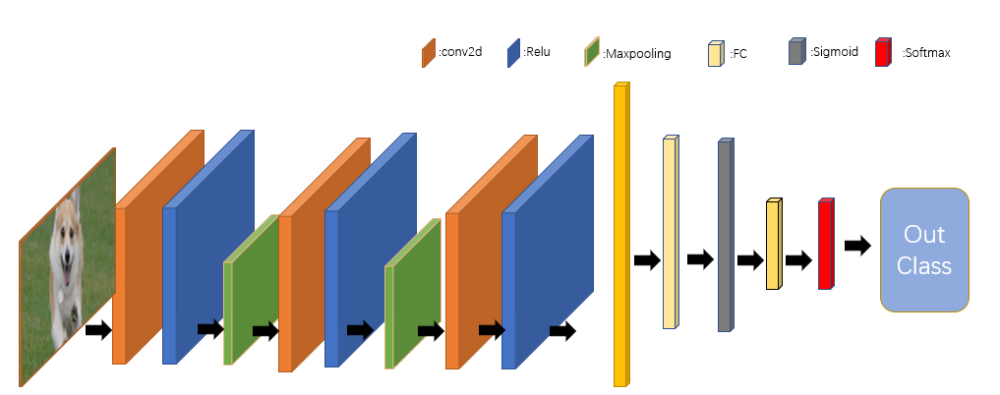
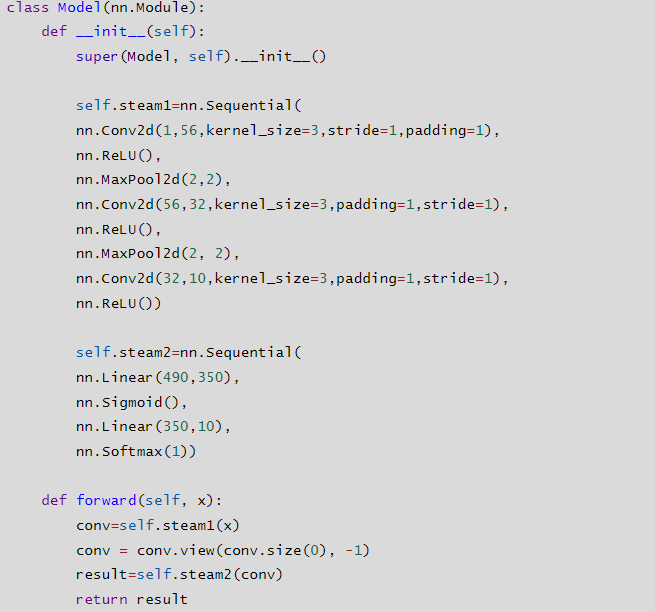
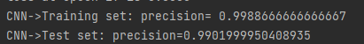

# CNN

[TOC]


## 一：代码：

```python
from torchvision import datasets, transforms
import torch
import torch.nn as nn
from torch import optim
import os


os.environ['KMP_DUPLICATE_LIB_OK'] = 'True'

# Checking if GPU is available
device = torch.device("cuda" if torch.cuda.is_available() else "cpu")

class DataLoader:

    def load_mnist(self, batch_size=64):

        transform = transforms.Compose([
            transforms.ToTensor(),
            transforms.Normalize((0.3,), (0.3,))
        ])
        trainset = datasets.MNIST('mnist_train', train=True, download=True, transform=transform)
        testset = datasets.MNIST('mnist_test', train=False, download=True, transform=transform)
        trainloader = torch.utils.data.DataLoader(trainset, batch_size=batch_size, shuffle=True)
        testloader = torch.utils.data.DataLoader(testset, batch_size=batch_size, shuffle=True)

        return trainloader, testloader


class Model(nn.Module):
    def __init__(self):
        super(Model, self).__init__()

        self.steam1=nn.Sequential(
        nn.Conv2d(1,56,kernel_size=3,stride=1,padding=1),
        nn.ReLU(),
        nn.MaxPool2d(2,2),
        nn.Conv2d(56,32,kernel_size=3,padding=1,stride=1),
        nn.ReLU(),
        nn.MaxPool2d(2, 2),
        nn.Conv2d(32,10,kernel_size=3,padding=1,stride=1),
        nn.ReLU())

        self.steam2=nn.Sequential(
        nn.Linear(490,350),
        nn.Sigmoid(),
        nn.Linear(350,10),
        nn.Softmax(1))

    def forward(self, x):
        conv=self.steam1(x)
        conv = conv.view(conv.size(0), -1)
        result=self.steam2(conv)
        return result


class Params:

    def __init__(self, lamuda=0.01, batch_size=64,epoch=20):
        self.lamuda = lamuda
        self.batch_size = batch_size
        self.epoch=epoch


class Criterion:
    def cross_entropy_loss(self, y_true, y_pred):
        log_y_pred = torch.log(y_pred + 1e-7)
        one_hot = torch.zeros_like(y_pred)
        one_hot.scatter_(1, y_true.long().unsqueeze(1), 1)
        loss = - torch.mean(log_y_pred * one_hot)

        return loss


class Utils:
    def __init__(self, params):

        self.params = params
        self.trainloader, self.testloader = DataLoader().load_mnist(self.params.batch_size)
        self.model = Model().to(device)
        self.optimizer = optim.Adam(self.model.parameters(), lr=0.01)


    def train_one_step(self, xs, ys):
        xs, ys = xs.to(device), ys.to(device)
        self.optimizer.zero_grad()
        y_preds = self.model(xs)
        loss = Criterion().cross_entropy_loss(ys, y_preds)
        loss.backward()
        self.optimizer.step()
        return loss

    def predict(self, xs):
        xs = xs.to(device)
        with torch.no_grad():
            y_preds = self.model(xs)
        return y_preds

    def evaluate(self, ys, ys_pred):
        ys, ys_pred = ys.to(device), ys_pred.to(device)
        ys_pred = torch.argmax(ys_pred, dim=1)
        diff_count = (len(ys) - torch.sum(torch.logical_not(torch.eq(ys, ys_pred)))).float()
        return diff_count / len(ys)


class Ways(Utils):
    def __init__(self, params):

        super(Ways, self).__init__(params)


    def Softmax(self):

        for epoch in range(self.params.epoch):
            for x, y in self.trainloader:
                x, y = x.to(device), y.to(device)
                loss = self.train_one_step(x,y)
            if epoch%1==0:
                print(f'loss at epoch {epoch} is {loss.item():.4f}')

        train_accuracy = self.evaluate_batch(self.trainloader)
        test_accuracy = self.evaluate_batch(self.testloader)
        print(f'CNN->Training set: precision= {train_accuracy}')
        print(f'CNN->Test set: precision={test_accuracy}')

    def evaluate_batch(self, dataloader):
        total_accuracy = 0
        total_count = 0
        for x, y in dataloader:
            x, y = x.to(device), y.to(device)
            y_pred = self.predict(x)
            total_accuracy += self.evaluate(y, y_pred).item() * len(y)
            total_count += len(y)
        return total_accuracy / total_count

class RunProcess:
    def __init__(self, params):

        self.comp = Ways(params)

    def run(self):
        self.comp.Softmax()

if __name__ == '__main__':

    params = Params(lamuda=0.01,batch_size=2048,epoch=20)
    process = RunProcess(params)
    process.run()
    # out
    # CNN->Training set: precision= 0.9993333333969117
    # CNN->Test set: precision=0.9901999979019165
```

## 二：分析与结论：


### 1）网络设计：



### 2）代码实现：



### 3）结果展示：



### 4）结论：

​			经过我不限的努力，终于把训练模型的各个部分，都封装成了类。以后做实验的时候，只需要修改某个类里面的内容就行了，非常的牛逼格拉斯。这次的实验是用cnn实现mnist数据集的分类，相对来说，这个是很简单的啦，没有什么困难的地方，我只需要把我的model类里面的forward函数重写一下就行。这里啊，我设计了3个卷积层，3个非线性层，2个池化层，2个全连接层，和一个softmax层，哦，对，两个softmax层之间我加了一个sigmoid层，为啥不加relu或者softmax或者tan呢？因为我发现，sigmoid的效果是最好的，尤其是晚上的时候。效果更是可以达到99.9发，非常的强劲。总的来说，有了前两次实验的经验，这次实验不是非常的困难。

​			但是困难还是有的，比如说上面的Dataloader函数，我死活理解不了，它返回的到底是啥，网上说，是个迭代器。那这迭代器是什么东西。哎呀妈呀，这可难住我了，到底是给什么东西。后来经过我2天左右的实践和证明，我发现，这玩意其实就和列表差不多。哎，英雄有泪沾满巾。
